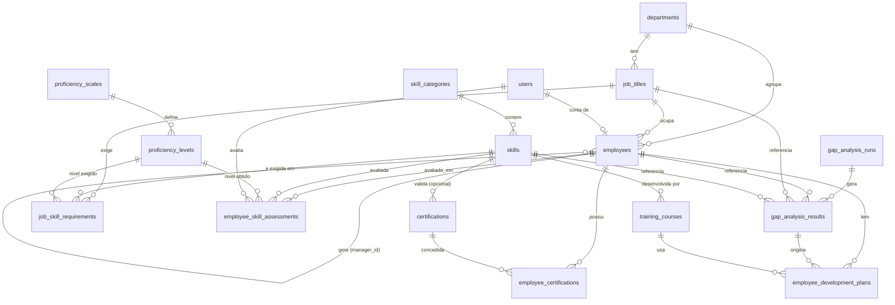

# Modelo de dados — Gap Analysis de Competências

> ⚠️ **Nota sobre o Excel**: mencionaste que já tens um modelo de dados em
> Excel, mas não encontrei nenhum ficheiro anexado a esta sessão/repositório.
> A proposta abaixo parte de uma estrutura de domínio típica para
> skills/certification gap analysis em RH. Quando partilhares o Excel,
> comparamos campo a campo e ajustamos nomes, enumerados e regras de negócio
> que já tenhas definido.

## 1. Pressupostos assumidos

- Uma "função"/"cargo" tem um conjunto de competências exigidas, cada uma com
  um nível mínimo desejado.
- Um colaborador tem competências avaliadas ao longo do tempo (não só um
  valor "atual" — interessa manter histórico de avaliações).
- Certificações são tratadas como uma entidade distinta de competências
  (têm entidade emissora, data de obtenção e podem expirar), mas podem estar
  ligadas a uma competência que validam.
- É preciso correr "análises de gap" pontuais (ex.: por departamento, por
  colaborador, por função) e guardar o resultado como snapshot para
  reporting histórico, não só calcular em tempo real.
- Múltiplos utilizadores (RH, gestores, colaboradores) acedem em simultâneo
  → precisa de controlo de acesso e de auditoria de quem alterou o quê.

Se algum destes pressupostos não corresponder ao que tens no Excel, diz-me e
ajusto o modelo.

## 2. Entidades principais

### Organização
- **departments** — departamentos, com hierarquia opcional (`parent_department_id`).
- **job_titles** — funções/cargos, associadas a um departamento.

### Catálogo de competências
- **skill_categories** — agrupamento (ex.: Técnica, Comportamental, Idiomas).
- **skills** — competências individuais.
- **proficiency_scales** / **proficiency_levels** — escalas de proficiência
  (ex.: 1–Iniciante … 5–Especialista), parametrizáveis em vez de fixas em
  código.
- **certifications** — certificações externas (entidade emissora, validade),
  opcionalmente ligadas a uma skill.

### Requisitos por função
- **job_skill_requirements** — nível exigido de cada skill para cada função,
  com versionamento temporal (`valid_from`/`valid_to`) para não perder
  histórico quando os requisitos de uma função mudam.

### Pessoas
- **employees** — colaboradores.
- **users** — contas de acesso à aplicação (RH admin, gestor, colaborador),
  opcionalmente ligadas a um `employee`.

### Avaliações (histórico nativo, não só auditoria)
- **employee_skill_assessments** — tabela *append-only*: cada avaliação de
  competência de um colaborador é uma nova linha (nunca se faz UPDATE). O
  "nível atual" é a avaliação mais recente por (employee, skill) — resolvido
  por view, não por um campo mutável. Isto dá histórico de evolução de
  competências "de fábrica", sem depender só do log de auditoria genérico.
- **employee_certifications** — certificações obtidas por colaborador,
  com data de obtenção/expiração.

### Análise de gap (snapshots)
- **gap_analysis_runs** — cabeçalho de uma corrida de análise (âmbito, data,
  autor).
- **gap_analysis_results** — resultado detalhado por colaborador/skill,
  guardado como snapshot (nível exigido, nível atual, gap, prioridade) para
  permitir comparar evolução entre análises ao longo do tempo.

### Desenvolvimento (opcional, mas natural extensão)
- **training_courses** — catálogo de formações, ligadas a skills.
- **employee_development_plans** — plano de ação para fechar gaps
  identificados.

### Auditoria
- **audit_log** — log genérico (tabela, registo, operação, dados antigos/novos
  em JSONB, autor, timestamp), alimentado por triggers nas tabelas sensíveis.

## 3. Esquema relacional (tabelas, PKs/FKs)

```
departments
  id                PK
  name
  parent_department_id  FK -> departments.id (nullable)
  created_at, updated_at, created_by, updated_by

job_titles
  id                PK
  title
  department_id     FK -> departments.id
  level             (ex.: junior/pleno/senior, opcional)
  is_active
  created_at, updated_at, created_by, updated_by

skill_categories
  id                PK
  name
  description

skills
  id                PK
  category_id       FK -> skill_categories.id
  name
  type              ENUM('technical','soft','language','certification_related')
  description
  is_active
  created_at, updated_at, created_by, updated_by

proficiency_scales
  id                PK
  name              (ex.: "Escala 1-5")

proficiency_levels
  id                PK
  scale_id          FK -> proficiency_scales.id
  level_value       INT   (ordem, ex.: 1..5)
  label             (ex.: "Iniciante", "Avançado")

certifications
  id                PK
  name
  issuing_body
  related_skill_id  FK -> skills.id (nullable)
  validity_months   INT (nullable = não expira)
  description

job_skill_requirements
  id                PK
  job_title_id      FK -> job_titles.id
  skill_id          FK -> skills.id
  required_level_id FK -> proficiency_levels.id
  mandatory         BOOLEAN
  weight            NUMERIC (nullable, para gap ponderado)
  valid_from        DATE
  valid_to          DATE (nullable = vigente)
  UNIQUE (job_title_id, skill_id, valid_from)

users
  id                PK
  email             UNIQUE
  password_hash
  role              ENUM('admin_rh','manager','employee','viewer')
  employee_id       FK -> employees.id (nullable)
  is_active
  last_login_at
  created_at, updated_at

employees
  id                PK
  employee_code     UNIQUE
  full_name
  email
  department_id     FK -> departments.id
  job_title_id      FK -> job_titles.id
  manager_id        FK -> employees.id (nullable, self-relation)
  hire_date
  status            ENUM('active','inactive','on_leave')
  created_at, updated_at, created_by, updated_by

employee_skill_assessments   -- append-only, histórico nativo
  id                PK
  employee_id       FK -> employees.id
  skill_id          FK -> skills.id
  level_id          FK -> proficiency_levels.id
  assessment_date   DATE
  assessed_by       FK -> users.id
  source            ENUM('self','manager','formal_test','360')
  notes
  created_at

employee_certifications
  id                PK
  employee_id       FK -> employees.id
  certification_id  FK -> certifications.id
  obtained_date
  expiry_date       (nullable)
  certificate_number
  attachment_url
  created_at, updated_at, created_by, updated_by

gap_analysis_runs
  id                PK
  name
  scope_type        ENUM('company','department','job_title','employee')
  scope_ref_id      (id da entidade conforme scope_type; ou colunas
                     scope_department_id / scope_job_title_id explícitas
                     se preferires FKs tipados em vez de referência genérica)
  run_date
  created_by        FK -> users.id
  status            ENUM('draft','completed')

gap_analysis_results
  id                PK
  run_id            FK -> gap_analysis_runs.id
  employee_id       FK -> employees.id
  job_title_id      FK -> job_titles.id
  skill_id          FK -> skills.id
  required_level_id FK -> proficiency_levels.id (nullable)
  current_level_id  FK -> proficiency_levels.id (nullable)
  gap_value         INT   -- required - current
  priority          ENUM('low','medium','high')

training_courses
  id                PK
  name
  provider
  related_skill_id  FK -> skills.id (nullable)
  duration_hours

employee_development_plans
  id                PK
  employee_id       FK -> employees.id
  gap_result_id     FK -> gap_analysis_results.id (nullable)
  course_id         FK -> training_courses.id (nullable)
  status            ENUM('planned','in_progress','completed','cancelled')
  target_date
  completed_date

audit_log
  id                PK (bigserial)
  table_name
  record_id
  operation         ENUM('INSERT','UPDATE','DELETE')
  old_data          JSONB (nullable)
  new_data          JSONB (nullable)
  changed_by        FK -> users.id (nullable)
  changed_at        TIMESTAMPTZ
```

Nota sobre `scope_ref_id` em `gap_analysis_runs`: uma referência genérica
exige validação em aplicação (sem FK real). Se preferires integridade
referencial estrita, troca por colunas nullable explícitas
(`scope_department_id`, `scope_job_title_id`, `scope_employee_id`) — mais
verboso mas com FKs verdadeiras.

## 4. Diagrama de relações



## 5. Histórico e auditoria

Três camadas complementares, cada uma para um problema diferente:

1. **Histórico de domínio como dados de primeira classe.**
   `employee_skill_assessments` é *append-only*: uma reavaliação nunca
   sobrescreve a anterior, cria-se uma nova linha. Isto dá "evolução de
   competência ao longo do tempo" sem depender de auditoria técnica — é
   informação que o RH quer consultar diretamente (ex.: gráfico de evolução
   por colaborador).

2. **Snapshots de análise.** `gap_analysis_runs`/`gap_analysis_results`
   congelam o resultado de uma análise numa data. Sem isto, "o gap era X em
   janeiro" torna-se impossível de reconstruir depois de os requisitos ou
   avaliações mudarem.

3. **Auditoria técnica genérica (`audit_log`).** Para tabelas onde há
   UPDATE/DELETE reais (`employees`, `job_titles`, `job_skill_requirements`,
   `skills`, `employee_certifications`, `users`), um trigger genérico em
   Postgres grava old/new em JSONB a cada operação. Vantagens sobre criar
   uma tabela `_history` por entidade:
   - uma única função de trigger reutilizável (`audit_trigger_fn()`) aplicada
     a todas as tabelas sensíveis;
   - não obriga a manter esquemas duplicados sincronizados a cada migração;
   - suporta pesquisa "quem alterou o quê" cross-table.

   Custo: consultas tipo "todas as alterações à tabela X" exigem filtrar
   `table_name` e fazer parse de JSONB — aceitável para auditoria (uso
   pouco frequente, não está no caminho crítico de leitura da app).

   Complementarmente, todas as tabelas mutáveis têm `created_at`,
   `updated_at`, `created_by`, `updated_by` para o caso comum (quem criou/
   alterou pela última vez), sem precisar de consultar o audit_log.

4. **Sem hard deletes em entidades referenciadas por histórico**
   (`employees`, `skills`, `job_titles`, `certifications`): usar
   `is_active`/`status` em vez de `DELETE`, para não partir FKs de
   `gap_analysis_results` ou `employee_skill_assessments` antigos.

## 6. Stack técnica sugerida

**Base de dados: PostgreSQL (14+)**
- Integridade referencial forte com muitas FKs cruzadas (essencial aqui —
  o modelo tem ~15 tabelas interligadas).
- MVCC dá bom comportamento com múltiplos utilizadores a ler/escrever em
  simultâneo sem bloqueios agressivos.
- Triggers nativos tornam o `audit_log` genérico trivial de implementar.
- JSONB para guardar old/new no audit log sem esquema rígido.
- Managed hosting persistente e com backups prontos a usar (Neon, Supabase,
  RDS, Azure Database for PostgreSQL) — cobre o requisito de "dados
  persistentes" sem geres infraestrutura.

**Backend: Node.js + TypeScript + NestJS + Prisma**
- Prisma mapeia bem este tipo de esquema (muitas relações 1:N e self-relations
  como `manager_id`), gera migrations versionadas a partir do `schema.prisma`,
  e dá type-safety ponta a ponta.
- NestJS estrutura por módulos (skills, employees, gap-analysis, auth) —
  adequado a um domínio com este número de entidades e regras de acesso
  (admin RH vs. gestor vs. colaborador).
- Autenticação/autorização via JWT + guards de role, mapeando diretamente
  para `users.role`.
- Alternativa igualmente válida: **Python + FastAPI + SQLAlchemy/Alembic** —
  escolhe esta se a equipa já for mais forte em Python ou se antecipares
  muito processamento analítico/relatórios (pandas) sobre os resultados de
  gap analysis.

**Concorrência multi-utilizador**: como o estado vive todo no Postgres e o
backend é stateless (API REST), múltiplas instâncias do backend podem correr
atrás de um load balancer sem partilhar estado em memória — o Postgres é
que garante consistência. Para muitas ligações simultâneas (ex.: deploy
serverless), usar pooling (PgBouncer, ou Prisma Accelerate/Data Proxy).

## 7. Questões em aberto para validar contigo

1. Podes partilhar o Excel para eu confirmar nomes de campos, enumerados
   (ex.: escalas de proficiência que já usam) e se falta alguma entidade?
2. Certificações têm fluxo de aprovação/validação por RH antes de contarem
   como "obtidas", ou é registo direto?
3. Um colaborador pode ocupar mais do que uma função em simultâneo, ou é
   sempre 1 função por colaborador (como assumi em `employees.job_title_id`)?
4. Precisas de suporte multi-empresa (multi-tenant) já nesta fase, ou é uma
   instância por organização?

Quando confirmares isto, avanço para o próximo passo (schema Prisma/SQL de
migração inicial).
