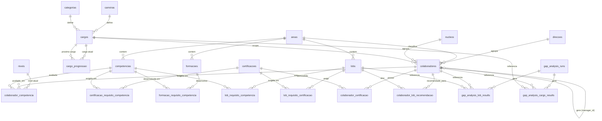

# Modelo de dados — Gap Analysis de Competências

> **v2 — validado contra `Tabelas_criação_programa.xlsx`.** Substitui os
> pressupostos genéricos da v1. A estrutura real tem um motor de pontuação
> por **LOB (Line of Business)** que a v1 não previa — ver secção 4.

## 1. O que o Excel realmente contém

11 folhas, resumidas abaixo (nome da folha → o que modela):

| Folha | Conteúdo | Linhas |
|---|---|---|
| `Direção&Área&Núcleo` | 3 listas de código independentes: Direção (divisão), Área (domínio funcional/tecnológico, ex. FI/DEV/HR/LO), Núcleo (equipa) | 27 |
| `Carreira&Categoria&Cargo` | Carreira (trilho: Architect/Manager/Consultant), Categoria (senioridade: Trainee…Principal), e o cruzamento real: Cargo | 11 |
| `Níveis` | Escala de proficiência única, 0–5, com descrição | 7 |
| `Competências` | Catálogo de competências, cada uma associada a uma Área | 98 |
| `Certificações` | Certificações + que competências/níveis cada uma valida | 48 |
| `Formações` | Formações + que competências/níveis cada uma desenvolve | 45 |
| `LOBS` | Linhas de negócio: pontuação mínima + requisitos de competências (com pontos e nível mínimo) + requisitos de certificações | 134 |
| `Colaboradores` | Ficha do colaborador: carreira/categoria/cargo/direção/núcleo/área, gestor, data de admissão | 198 |
| `Colaboradores&Competências` | Avaliação atual de cada colaborador por competência | 4997 |
| `Colaboradores&Certificações` | Certificações obtidas por colaborador | 4 (amostra) |
| `Colaboradores&Lob recomendação` | LOBs recomendados a um colaborador (próprio/gestor/automático) | 4 (amostra) |

## 2. A descoberta principal: LOBs são o motor de gap real

Não é o Cargo que define diretamente as competências exigidas. É o **LOB**
(ex.: "Recruit to Hire", "Payroll", "Sourcing & Procurement"):

- Cada LOB tem um **`pontos_minimos`** (ex.: 70) para ser considerado
  "atingido".
- Cada LOB lista as competências que conta, cada uma com: `obrigatório`
  (sim/não), `pontos` (peso) e `nível mínimo`.
- Um colaborador "pontua" numa competência da LOB só se o seu nível atual
  ≥ nível mínimo exigido; os pontos das competências que cumpre somam-se.
- Uma LOB só está "atingida" se: (a) a soma de pontos ≥ `pontos_minimos`,
  e (b) todas as competências marcadas `obrigatório` estão cumpridas, e
  (c) todas as certificações marcadas `obrigatório` na LOB estão na posse
  do colaborador.
- O **Cargo** só entra depois: tem um campo `Lobs Exigidos` — um número
  (ex.: 2, 3) de LOBs que um colaborador nesse cargo precisa de atingir
  (não uma lista de LOBs específicas — fica em aberto quais).

Isto é uma diferença estrutural importante face à v1 (que assumia
`job_skill_requirements` diretas por cargo). O gap analysis certo é:
**colaborador → LOB (via competências/certificações com pontos) → cargo
(via contagem de LOBs atingidas)**.

## 3. Esquema relacional (revisto)

Mantenho os nomes em português, alinhados com as folhas de origem.

```
-- Organização --------------------------------------------------

direcoes
  id                PK
  nome
  relevante         BOOLEAN

areas
  id                PK
  nome              -- ex.: Data&AI, DEV, FI, HR, LO, N/A, Other
                     -- domínio partilhado por competências, LOBs,
                     -- formações e colaboradores

nucleos
  id                PK
  nome
  -- (*) sem FK a direcoes no Excel — ver questão em aberto 7.1

carreiras
  id                PK  (código, ex. "ARC")
  nome
  relevante         BOOLEAN

categorias
  id                PK  (código, ex. "PLE")
  nome              -- Trainee, Junior, Associate, Pleno, Senior, Principal

cargos
  id                PK  (código, ex. "ARC_PLE")
  nome
  carreira_id       FK -> carreiras.id
  categoria_id      FK -> categorias.id
  anos_experiencia_minimo  INT (nullable)
  lobs_exigidos     INT (nullable) -- nº de LOBs a atingir, não uma lista
  relevante         BOOLEAN
  relevante_carreira BOOLEAN

cargo_progressao   -- "Próximo Cargo" tinha valores tipo "MAN_ASS|ARC_ASS":
                    -- mais que um cargo seguinte possível → bridge, não FK simples
  cargo_id          FK -> cargos.id
  proximo_cargo_id  FK -> cargos.id
  PK (cargo_id, proximo_cargo_id)

niveis              -- escala única 0-5, partilhada por toda a app
  id                PK  (0..5)
  nome              -- Inexistente, Familiarizado, Principiante,
                     -- Proficiente, Especialista, Referência
  descricao         TEXT

-- Catálogo de competências / certificações / formações ---------

competencias
  id                PK
  nome
  area_id           FK -> areas.id

certificacoes
  id                PK  (código, ex. "C_ABAPD")
  nome

certificacao_requisito_competencia
  id                PK
  certificacao_id   FK -> certificacoes.id
  competencia_id    FK -> competencias.id
  nivel_id          FK -> niveis.id
  -- que competências/níveis uma certificação valida (nem todas
  -- as certificações do Excel têm isto preenchido ainda)

formacoes
  id                PK
  nome
  area_id           FK -> areas.id

formacao_requisito_competencia
  id                PK
  formacao_id       FK -> formacoes.id
  competencia_id    FK -> competencias.id
  nivel_id          FK -> niveis.id

-- LOBs (motor de gap) --------------------------------------------

lobs
  id                PK
  nome
  area_id           FK -> areas.id
  pontos_minimos    INT

lob_requisito_competencia
  id                PK
  lob_id            FK -> lobs.id
  competencia_id    FK -> competencias.id
  obrigatorio       BOOLEAN
  pontos            INT
  nivel_minimo_id   FK -> niveis.id

lob_requisito_certificacao
  id                PK
  lob_id            FK -> lobs.id
  certificacao_id   FK -> certificacoes.id
  obrigatorio       BOOLEAN

-- Pessoas ---------------------------------------------------------

users                -- contas de acesso à aplicação (não existe no Excel)
  id                PK
  email             UNIQUE
  password_hash
  role              ENUM('admin_rh','manager','employee','viewer')
  colaborador_id    FK -> colaboradores.id (nullable)
  is_active
  created_at, updated_at, last_login_at

colaboradores
  id                PK   (numérico, igual ao "ID Colaborador" do Excel)
  nome
  carreira_id       FK -> carreiras.id   (nullable — nem todos têm)
  categoria_id      FK -> categorias.id  (nullable)
  cargo_id          FK -> cargos.id      (nullable)
  direcao_id        FK -> direcoes.id    (nullable)
  nucleo_id         FK -> nucleos.id     (nullable)
  area_id           FK -> areas.id       (nullable)
  manager_id        FK -> colaboradores.id (nullable, self-relation)
  e_bum             BOOLEAN
  data_admissao     DATE (nullable)
  created_at, updated_at, created_by, updated_by

-- Avaliações (bridges, com histórico acrescentado — ver secção 5) --

colaborador_competencia
  id                PK
  colaborador_id    FK -> colaboradores.id
  competencia_id    FK -> competencias.id
  nivel_id          FK -> niveis.id
  data_avaliacao    DATE          -- NOVO face ao Excel
  avaliado_por      FK -> users.id (nullable) -- NOVO
  origem            ENUM('self','manager','formal','360') -- NOVO
  created_at

colaborador_certificacao
  id                PK
  colaborador_id    FK -> colaboradores.id
  certificacao_id   FK -> certificacoes.id
  data_obtencao     DATE (nullable) -- NOVO, o Excel só tinha validade
  data_validade     DATE (nullable)
  anexo_url         TEXT (nullable) -- NOVO, evidência
  created_at, updated_at

colaborador_lob_recomendacao
  id                PK
  colaborador_id    FK -> colaboradores.id
  lob_id            FK -> lobs.id
  proprio           BOOLEAN  -- auto-indicação
  bud               BOOLEAN  -- indicação do gestor/BUD
  auto              BOOLEAN  -- sugestão automática do sistema (por gap)
  created_at

-- Snapshots de gap analysis (não existem no Excel, mas necessários
-- para reporting histórico e para não recalcular tudo em tempo real) --

gap_analysis_runs
  id                PK
  scope_type        ENUM('empresa','direcao','area','cargo','colaborador')
  scope_direcao_id      FK -> direcoes.id (nullable)
  scope_cargo_id        FK -> cargos.id (nullable)
  scope_colaborador_id  FK -> colaboradores.id (nullable)
  run_date
  created_by        FK -> users.id
  status            ENUM('draft','completed')

gap_analysis_lob_results   -- resultado por colaborador x LOB
  id                PK
  run_id            FK -> gap_analysis_runs.id
  colaborador_id    FK -> colaboradores.id
  lob_id            FK -> lobs.id
  pontos_obtidos    INT
  pontos_minimos    INT       -- congelado no momento do snapshot
  atingido          BOOLEAN
  obrigatorios_em_falta INT   -- contagem de obrigatórios não cumpridos

gap_analysis_cargo_results  -- resultado por colaborador x cargo
  id                PK
  run_id            FK -> gap_analysis_runs.id
  colaborador_id    FK -> colaboradores.id
  cargo_id          FK -> cargos.id
  lobs_exigidos     INT
  lobs_atingidos    INT
  gap               INT       -- lobs_exigidos - lobs_atingidos

-- Auditoria técnica genérica ---------------------------------------

audit_log
  id                PK (bigserial)
  table_name
  record_id
  operation         ENUM('INSERT','UPDATE','DELETE')
  old_data          JSONB (nullable)
  new_data          JSONB (nullable)
  changed_by        FK -> users.id (nullable)
  changed_at        TIMESTAMPTZ
```

## 4. Diagrama de relações



## 5. Histórico e auditoria (ajustado ao Excel real)

O Excel guarda **apenas o estado atual** em `Colaboradores&Competências` e
`Colaboradores&Certificações` — sem data de avaliação, sem quem avaliou.
Mantenho a recomendação da v1:

1. `colaborador_competencia` passa a ser **append-only** com `data_avaliacao`
   + `avaliado_por` + `origem`. O "nível atual" é a avaliação mais recente
   por (colaborador, competência) — resolvido por view, nunca por UPDATE.
   Isto dá evolução de competência ao longo do tempo, que o Excel não tem
   hoje mas que é natural pedir-se num gap analysis ("melhorou desde a
   última avaliação?").
2. `gap_analysis_lob_results` / `gap_analysis_cargo_results` congelam o
   resultado do cálculo de pontos numa data — sem isto, não é possível
   reconstruir "que LOBs estavam atingidas em março" depois de os
   requisitos ou avaliações mudarem.
3. `audit_log` genérico (trigger Postgres, JSONB old/new) nas tabelas
   mutáveis (`colaboradores`, `cargos`, `lob_requisito_*`, `certificacoes`,
   `users`), complementado por `created_at/updated_at/created_by/updated_by`.
4. Sem hard deletes em entidades referenciadas por histórico — usar
   `relevante`/`is_active` (o Excel já usa `relevante` em `direcoes`,
   `carreiras`, `cargos` — sigo essa convenção em vez de introduzir um
   `is_active` paralelo).

## 6. Problemas de qualidade de dados encontrados (a tratar na importação)

1. **`Colaboradores`, linhas 31–32**: `ID Colaborador = 160` (Miguel
   Santana) está duplicado, com `Área` diferente em cada linha (DEV vs.
   Other). Precisa de decisão de negócio antes de importar (qual a linha
   correta, ou fundir).
2. **Coluna "BUM" é o nome do gestor em texto livre**, não um ID. Confirmei
   que todos os 16 valores de `BUM` correspondem a um nome existente na
   própria lista de colaboradores, por isso dá para resolver
   `manager_id` por join de nome na importação — mas a partir daí deve
   passar a ser sempre FK (`colaboradores.manager_id`), nunca texto.
3. **Folha `Formações`**: o cabeçalho da coluna B diz "Certificação" mas o
   conteúdo é o nome da formação (erro de copy/paste no Excel). A coluna G
   ("Formação") tem uma fórmula `VLOOKUP` partida a apontar para
   `TAB_Certificação` em vez da tabela de formações, por isso devolve
   `#N/A` em todas as linhas. Usar a coluna B como nome canónico da
   formação e ignorar a coluna G na importação.
4. **`Colaboradores&Certificações`**: uma `Data de validade` tem o valor
   literal `31/06/2026`, que não é uma data válida (junho só tem 30 dias).
   Precisa de correção na origem.
5. **Núcleo não tem FK explícita para Direção** no Excel, apesar de os
   nomes sugerirem hierarquia (ex.: Núcleos "AMS", "AMS - HCM",
   "AMS - OUT", "AMS - SF" parecem sub-equipas da Direção "AMS"). Um
   colaborador tem `direcao_id` e `nucleo_id` de forma independente, o que
   permite combinações inconsistentes. Ver questão 7.1.
6. **Cobertura de dados parcial**: só 63 dos 196 colaboradores têm
   avaliações de competências; certificações só estão preenchidas para 1
   colaborador; recomendações de LOB só para 2. Não é um problema de
   esquema — é expectável em dados de arranque — mas convém não assumir
   que a folha atual é o dataset completo.

## 7. Questões em aberto para validar contigo

1. **Núcleo pertence a uma Direção?** Se sim, adiciono
   `nucleos.direcao_id FK`. Se não, confirmo que são eixos de classificação
   independentes mesmo.
2. **`cargos.lobs_exigidos` é só uma contagem** ("precisa de atingir 2
   LOBs") **ou há LOBs específicas obrigatórias por cargo**? Se houver
   específicas, preciso de uma tabela `cargo_lob_exigida` em vez de (ou
   além de) um número solto.
3. Confirmam a fórmula de pontuação da LOB que descrevi na secção 2 (soma
   de pontos das competências cumpridas ≥ `pontos_minimos`, mais todos os
   obrigatórios — competências e certificações — cumpridos)? É a leitura
   que faço da estrutura `LOBS`, mas vale confirmar antes de a codificar.
4. Certificações/formações têm fluxo de aprovação por RH antes de
   contarem como válidas, ou é registo direto pelo colaborador/gestor?
5. Precisas de suporte multi-empresa (multi-tenant) já nesta fase?

Quando confirmares os pontos 1–3 (os que têm impacto direto no esquema),
avanço para o schema Prisma/SQL de migração inicial, já com um script de
importação do Excel para popular as tabelas de catálogo (Direção, Área,
Núcleo, Carreira, Categoria, Cargo, Níveis, Competências, Certificações,
Formações, LOBs) e os dados de `Colaboradores`.
